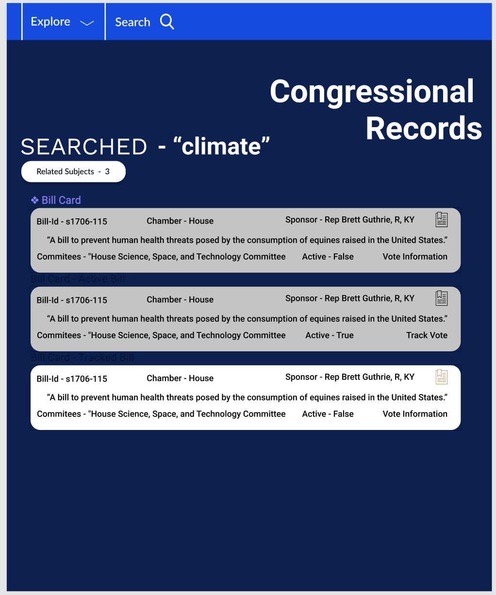
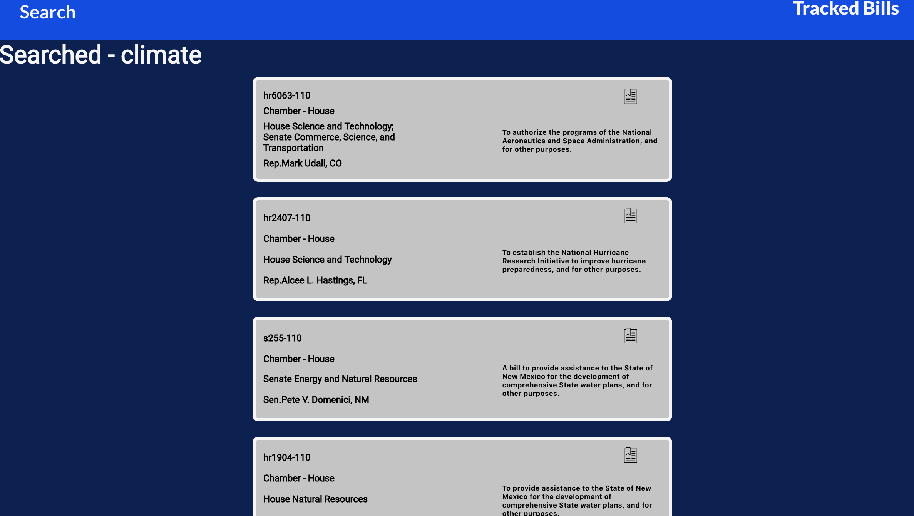

## Congressional-Records

## Installation Instructions 

 - In your terminal complete the following: 
 - Clone down this repo, run `git clone https://github.com/Dhanciles/congressional-records.git`
 - cd into the directory
 - `npm install` in your terminal
 - `npm start` in your terminal

 ## Background 

  For this project I delovered an application that allows users to browse proposed and voted on bills that are stored in Congressional Records. The User is able to search for any number of topics or use a menu that renders bills based on their query. My goal was to gather great design inspiration to deliver a sleek UI that also delivers the user an enjoyable experience. I used the ProPublica Congress API to gather the information and have it avaialble upon the user's request.

## Tech Stack

- React
- React Router
- Redux
- Jest
- Enzyme

## Wireframes 

## Application 

